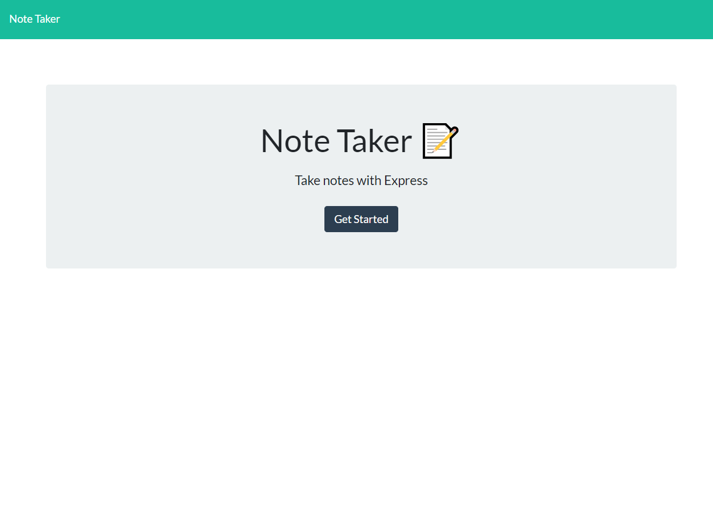
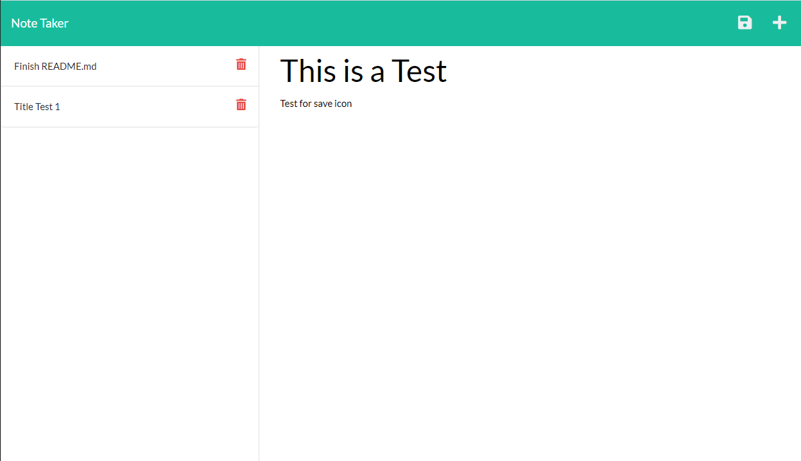

  # Note-Taker Express
  

  
  ## Table-of-Contents
  * [Description](#description)
  * [Installation](#installation)
  * [Questions](#questions)

[ISC](https://choosealicense.com/licenses/ISC)

 
  ## [Description](#table-of-contents)
  Note taking application where you can save/delete notes using an express backend. 

  View the application on [Heroku](https://damp-garden-34689.herokuapp.com/)
   
  ## [Installation](#table-of-contents)
  Clone the repository install the dependencies by running the following command: 
   npm i 
  
  
  

  ## [License](#table-of-contents)
  This application has the following license:
  [ISC](https://choosealicense.com/licenses/ISC)
    
  ## [Questions](#table-of-contents)
  Contact me with any questions at the following:
 * [GitHub](https://github.com/BurnsD)
 * [Email: DustinBurnsDev@gmail.com](mailto:DustinBurnsDev@gmail.com)
  